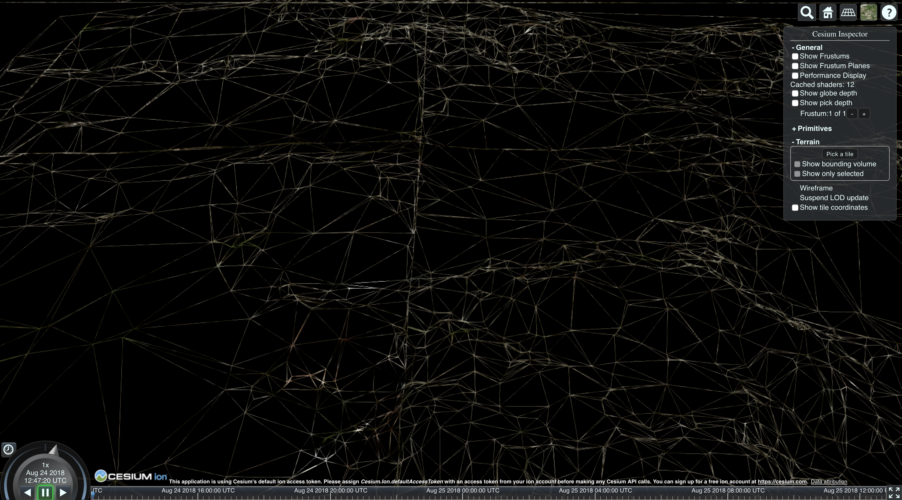
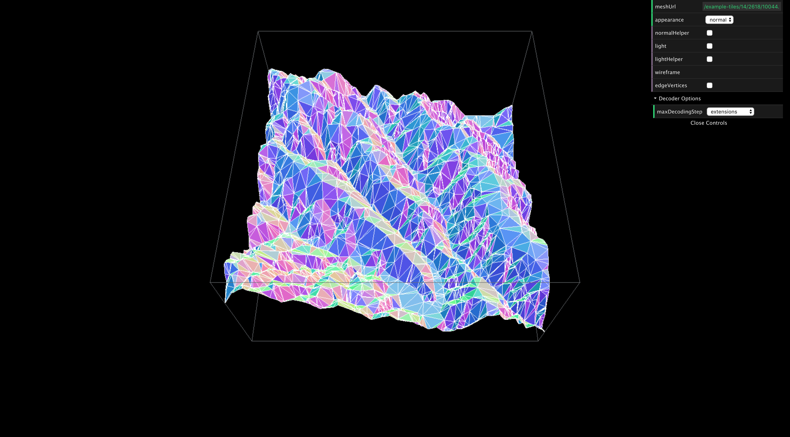

Quantized Mesh Viewer
===========================

Render custom [quantized mesh](https://github.com/AnalyticalGraphicsInc/quantized-mesh) tiles in Cesium and debug individual tiles using THREE.js renderer.


### Run

```
docker build -t qm-viewer .
docker run -t -i --name qm-viewer -p 8080:8080 -v $(pwd):/usr/src/app qm-viewer
```
At *http://localhost:8080* you'll see a Cesium map with example terrain tiles.




To debug individual tile go to *http://localhost:8080/tile.html*.



On the right panel change the path to the tile and adjust debug parameters.


### Custom Tiles

By default application renders example tiles from `./example-tiles` folder. To serve files from different location customize `SurfaceProvider` parameters in the `./src/map/index.js`.

Application serves statics from its whole root directory so you can put folder with custom tiles next to the `./example-tiles` folder.


### Configuring `SurfaceProvider`

```
new SurfaceProvider(options)
```

Options:
* getUrl: (x: Number, y: Number, level: Number) → String  
  Required  
  Constructs URL to fetch a tile using provided grid coordinates.
* tilingScheme: Cesium.TilingScheme  
  Optional  
  Default — Cesium.WebMercatorTilingScheme
* credit: [Cesium.Credit]  
  Optional  
  Credits for a tiles data


### Notes

- Cesium cannot render tiles for a specific zoom level unless you provide tiles for all parent level. The `SurfaceProvider` mocks missing tiles with a plane geometry.


### Links

* [Quantized Mesh Decoder](https://deveo.in.here.com/HERE/projects/surface/repositories/quantized-mesh-decoder/tree/master)
* [Quantized Mesh Format Specification](https://github.com/AnalyticalGraphicsInc/quantized-mesh)


